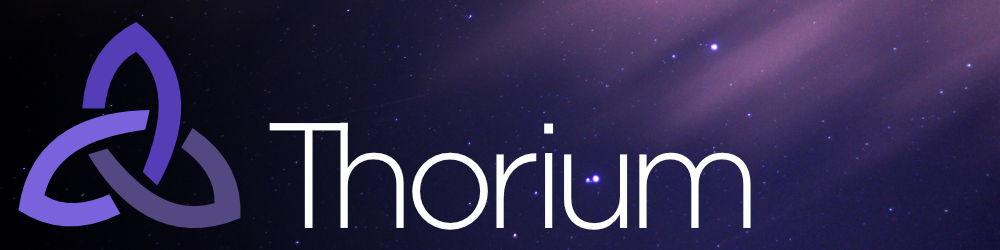

[](#contributors)

[](https://travis-ci.org/Thorium-Sim/thorium)
[](https://discord.gg/UvxTQZz)

# Thorium

## A simulator controls platform

_New here? Check out the [contributing document](CONTRIBUTING.md)_

Want something to work on? Here's where
[we need help](https://github.com/Thorium-Sim/thorium/labels/help%20wanted). Not
sure how to work with Thorium? Guides are in the
[wiki](https://github.com/Thorium-Sim/thorium/wiki). Thorium accepts
[donations](https://thoriumsim.com/en/donate.html).

## What is Thorium

Thorium is a simulator controls platform which eventually hopes to encapsulate
the following features (and maybe more):

- Multiple simulators in the same framework

- Multiple stations and cards

- Arbitrary card assignments that can update in realtime

- Realtime data sharing across devices

- Federated architecture for supporting satellite devices (e.g. lighting
  control, Arduino panels, etc.)

- Lighting Control

- Sound Control

- Video Control

- 3D Rendering

- Physics Simulations

- Pre-recorded macros

- Timelines

And more. The above merely scratches the surface.

Thorium is flexible enough to provide a system for creating an integrated,
distributed, fault-tolerant show-control system that can power lights, sound,
video, and take input and provide output to a wide variety of devices.

Created with ❤ by [Alex Anderson](http://ralexanderson.com) and
[Fyreworks](https://fyreworks.us).

## Getting Started

```sh
npm install
npm run start
```

Then open [the app](http://localhost:3000) or
[GraphiQL](http://localhost:3001/graphiql)

## Building the App

```
npm run build
```

Builds the app for production and bundles it into a packaged terminal app.

## Open-source Assets

You can download open-source licensed assets to be used with Thorium
[here](https://drive.google.com/open?id=0B-UK2-Zf7K9ycUJScHJlWW92MjQ).

_Interested in contributing your own images, movies, sounds, and more to this
repository? [File an Issue](https://github.com/Thorium-Sim/thorium/issues/new)_
and we'll give you access.

## Contributors

Thanks goes to these wonderful people
([emoji key](https://github.com/kentcdodds/all-contributors#emoji-key)):

<!-- ALL-CONTRIBUTORS-LIST:START - Do not remove or modify this section -->
<!-- prettier-ignore -->
| [<br /><sub><b>Alex</b></sub>](http://ralexanderson.com)<br />[💻](https://github.com/thorium-sim/Thorium/commits?author=alexanderson1993 "Code") [📖](https://github.com/thorium-sim/Thorium/commits?author=alexanderson1993 "Documentation") [🎨](#design-alexanderson1993 "Design") | [<br /><sub><b>Emrix</b></sub>](https://github.com/Emrix)<br />[💻](https://github.com/thorium-sim/Thorium/commits?author=Emrix "Code") [👀](#review-Emrix "Reviewed Pull Requests") [🤔](#ideas-Emrix "Ideas, Planning, & Feedback") | [<br /><sub><b>ctolley6</b></sub>](https://github.com/ctolley6)<br />[🤔](#ideas-ctolley6 "Ideas, Planning, & Feedback") [✅](#tutorial-ctolley6 "Tutorials") | [<br /><sub><b>Todd Rasband</b></sub>](https://github.com/Rasbandit)<br />[🎨](#design-Rasbandit "Design") | [<br /><sub><b>Brent Anderson</b></sub>](http://www.brentjanderson.com)<br />[🤔](#ideas-brentjanderson "Ideas, Planning, & Feedback") | [<br /><sub><b>Farpoint</b></sub>](http://www.farpointStation.org)<br />[🐛](https://github.com/thorium-sim/Thorium/issues?q=author%3Afarpoint "Bug reports") | [<br /><sub><b>Isaac Ostler</b></sub>](https://github.com/isaacOstler)<br />[🐛](https://github.com/thorium-sim/Thorium/issues?q=author%3AisaacOstler "Bug reports") |
| :---: | :---: | :---: | :---: | :---: | :---: | :---: |
| [<br /><sub><b>Jed Fox</b></sub>](https://j-f1.github.io)<br />[💻](https://github.com/thorium-sim/Thorium/commits?author=j-f1 "Code") | [<br /><sub><b>Lilah</b></sub>](https://github.com/G33kX)<br />[💻](https://github.com/thorium-sim/Thorium/commits?author=G33kX "Code") | [<br /><sub><b>kimballfrank</b></sub>](https://github.com/kimballfrank)<br />[🎨](#design-kimballfrank "Design") | [<br /><sub><b>aBlueShadow</b></sub>](https://github.com/aBlueShadow)<br />[🤔](#ideas-aBlueShadow "Ideas, Planning, & Feedback") [🌍](#translation-aBlueShadow "Translation") |
<!-- ALL-CONTRIBUTORS-LIST:END -->

This project follows the
[all-contributors](https://github.com/kentcdodds/all-contributors)
specification. Contributions of any kind welcome!
